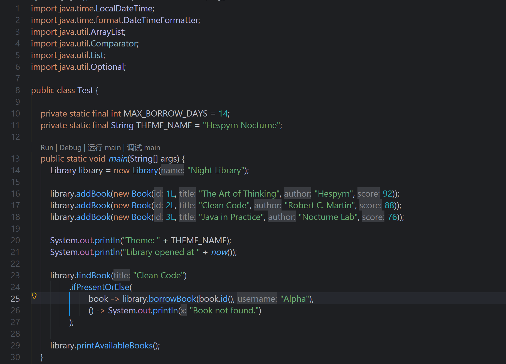
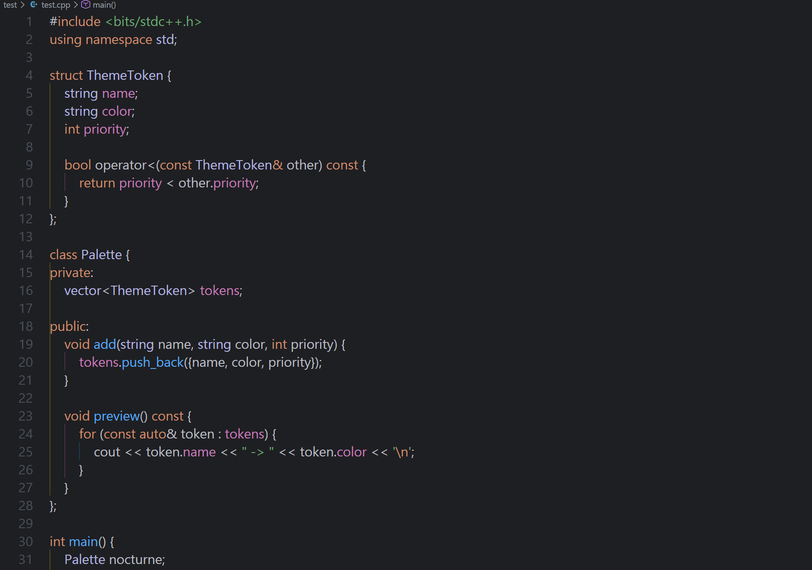
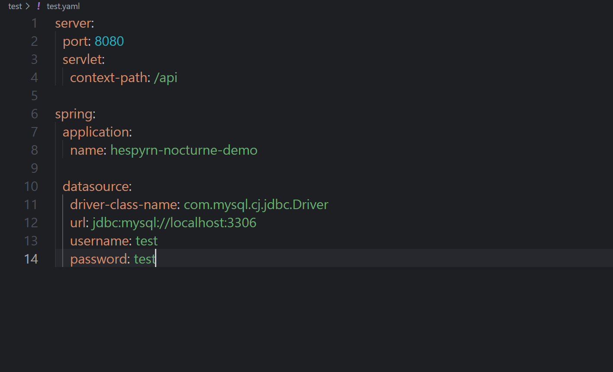

# Hespyrn Nocturne

一个从 JetBrains IDEA 配色方案转换并重新调整而来的 VS Code 深色主题。

Hespyrn Nocturne 保留了 IDEA / JetBrains 系深色主题的沉静质感：灰黑色背景、暖橙色关键字、蓝色函数、绿色字符串，以及柔和的紫色类型与成员变量。它不是一个追求强烈对比度的主题，而是希望在长时间写代码时保持舒服、清晰、安静。

## 预览

### Java



### C++



### YAML



## 为什么做这个主题

我平时很喜欢 JetBrains IDEA 里的这套暗色观感，但在 VS Code 里一直找不到完全顺眼的替代品。

很多主题要么颜色太亮，要么对比太硬，要么 Java、C++、YAML 这些常用语言的高亮不太符合我的习惯。于是我把自己正在用的 IDEA `.icls` 配色方案转换成了 VS Code 主题，并在实际代码里一点点调整：

- 数字不应该莫名变成斜体；
- Java 的 import / package 路径不应该整片都是关键词颜色；
- YAML 的 key 需要更像配置项，而不是普通字符串；
- 注解、类型、字段、函数要尽量保持 IDEA 那种熟悉的层次感。

最后整理成了这个主题：**Hespyrn Nocturne**。

名字里的 `Nocturne` 有夜曲、夜色的意思。它更像是一套适合夜里写代码的主题：安静、低调，但仍然有一点属于自己的颜色。

## 特性

- IDEA 风格的深色配色
- 低刺激、适合长时间使用的编辑器背景
- 暖橙色关键字
- 蓝色函数与方法
- 绿色字符串
- 柔和绿色注释
- 紫色类型、字段与属性
- 青色数字字面量
- 针对 Java、C++、YAML 与常见 Web 语法做过细调
- 保留 VS Code semantic highlighting，以保证 Java 等语言的稳定高亮效果

## 安装

### 从 VSIX 安装

1. 下载 `hespyrn-nocturne-1.0.0.vsix`。
2. 打开 VS Code。
3. 按下 `Ctrl + Shift + P`。
4. 输入并运行 `Extensions: Install from VSIX...`。
5. 选择下载好的 `.vsix` 文件。
6. 按下 `Ctrl + K Ctrl + T`。
7. 选择 `Hespyrn Nocturne`。

## 主题信息

```text
Theme: Hespyrn Nocturne
Author: Hespyrn, with ChatGPT
```

## 配色表

| 元素 | 颜色 |
| --- | --- |
| 编辑器背景 | `#1e1f22` |
| 默认前景色 | `#bcbec4` |
| 关键字 | `#cf8e6d` |
| 函数 / 方法 | `#56a8f5` |
| 字符串 | `#6aab73` |
| 注释 | `#67a37c` |
| 类型 / 类 | `#b5b6e3` |
| 字段 / 属性 | `#c77dbb` |
| 数字 | `#2aacb8` |
| 选区 | `#214283` |

## 注意

这个主题来源于 IDEA `.icls` 配色方案，并被适配到了 VS Code。

JetBrains IDE 和 VS Code 的语法 token 体系并不完全一致，所以不同语言、不同插件下的颜色不会做到 100% 完全一致。当前版本更偏向实际可用性和整体观感，而不是强行逐项还原。

## 更新记录

### 1.0.0

- 发布初始 Release 版本。
- 主题命名为 `Hespyrn Nocturne`。
- 作者标注为 `Hespyrn, with ChatGPT`。
- 调整 Java、C++、YAML 和常见编辑器 UI 配色。
- 修正数字字面量斜体问题。
- 调整 YAML key 颜色。
- 保留稳定的 Java 语义高亮行为。

## License

Personal theme release.

你可以自由修改并用于个人用途。
